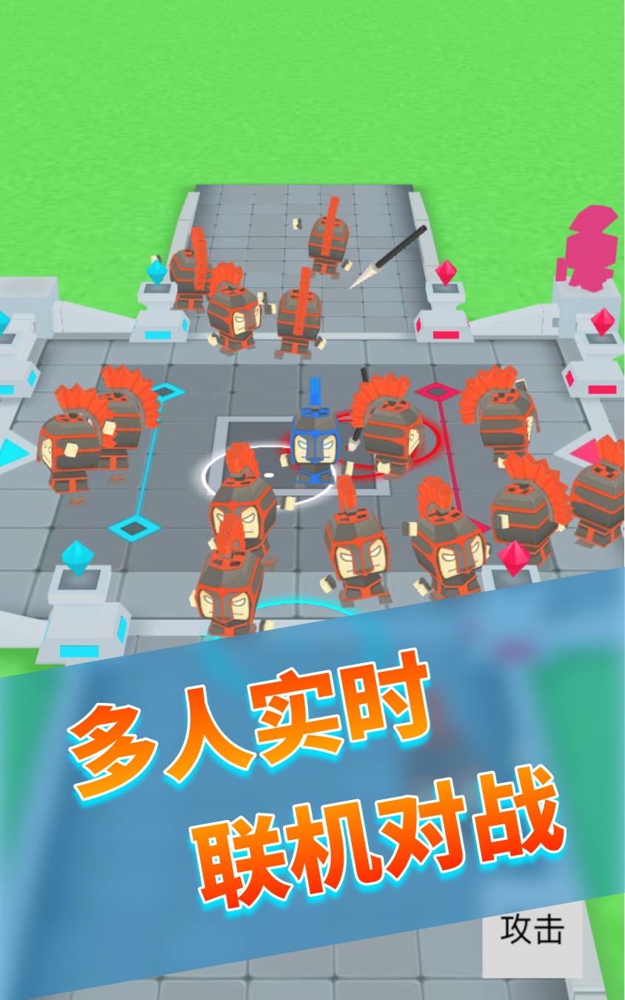
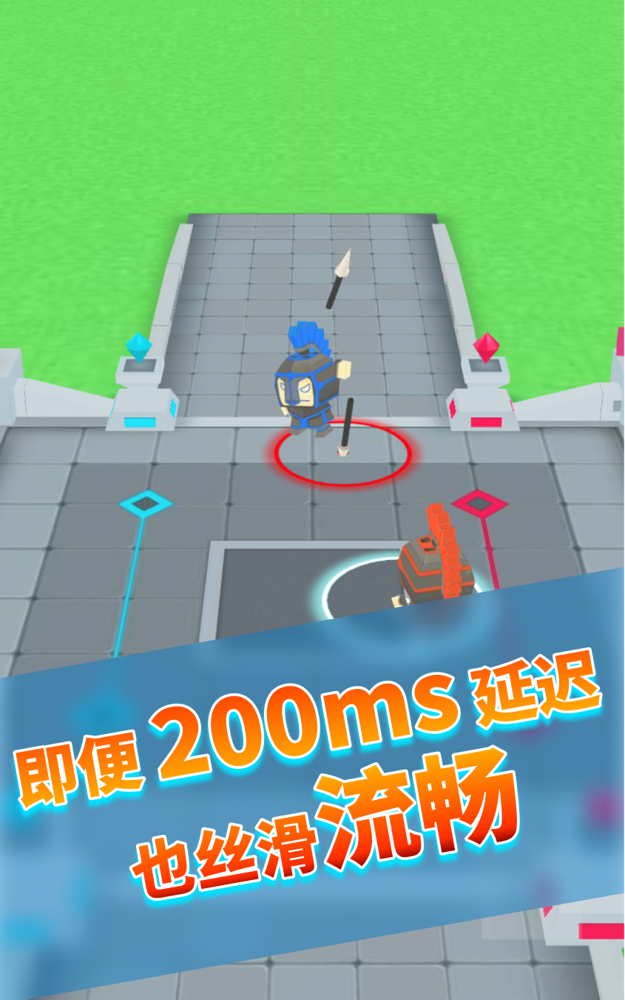
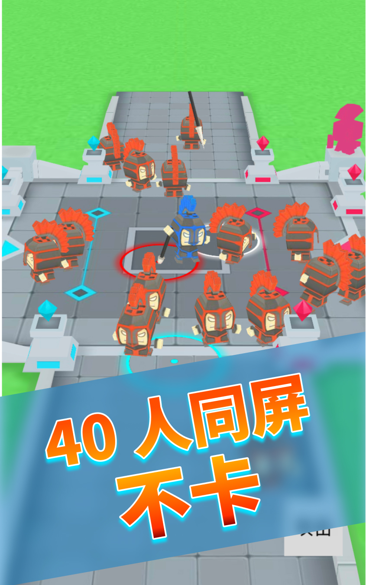
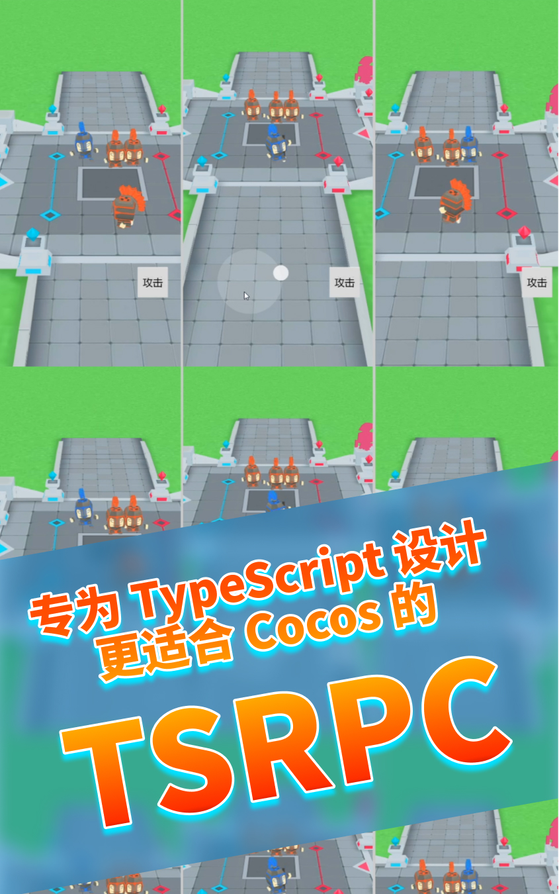

# TSRPC + Cocos 多人实时对战 Demo

## 介绍

- 采用 [TSRPC](https://tsrpc.cn) 和 [Cocos Creator](https://www.cocos.com/) 开发的多人实时对战游戏 Demo
- 逻辑和表现分离的架构，帧同步和状态同步并用，前后端复用状态计算逻辑
- 快节奏有冲突的同步策略：预测 + 和解 + 插值 的落地运用展示，100~200 ms 延迟也无感知

**体验地址**
https://tsrpc.cn/fight/index.html
(可浏览器多开体验多人效果)

## 在线教程
- 文章：
    - [2 天做了个多人实时对战，200ms 延迟竟然也能丝滑流畅？](https://mp.weixin.qq.com/s/V1YWPF5LmY-l1L5LF2nR3A)
- 视频：
    - [2021-12-04 Cocos Star Meeting 深圳站](https://www.bilibili.com/video/BV16F411z7iP)
- Github 源码地址
    - https://github.com/k8w/tsrpc-examples/tree/main/examples/cocos-creator-multiplayer


    

## 启动

### 先启动后端

```shell
cd backend

# 安装依赖
npm install

# 启动本地服务
npm run dev
```

### 再启动前端

1. 首先安装 NPM 依赖
    ```shell
    cd frontend

    # 安装依赖
    npm install
    ```
2. 然后用 Cocos Creator 3.3.2 以上版本打开前端项目（`frontend` 目录）

**注意：前端项目需要先 `npm install` 后再打开 Cocos，如果报错，可以关闭 Cocos 后重启试一下。**

## 效果预览

https://user-images.githubusercontent.com/1681689/144695691-c8c556dd-68c4-44bf-8a38-5c37e203dbda.mp4